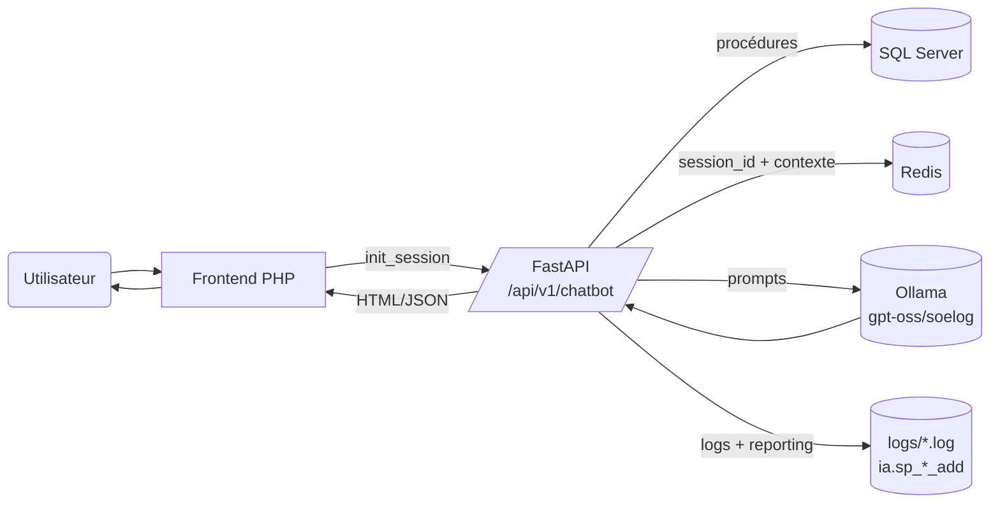

# Architecture détaillée du chatbot Soelog IA

> Mise à jour novembre 2025 à partir des documents historiques (`app/old_docs/Architecture_Technique.docx`, `app/old_docs/Cahier_Technique.docx`) et du code courant (`app/`).

## 1. Vue d'ensemble

- **Frontend PHP** (hérité) : composant web qui authentifie l'utilisateur, collecte les identifiants métier (`sa_fk`, `form_fk`, `user_fk`) et transmet les questions vers l'API Python.
- **Backend FastAPI** (`app/main.py`) : noyau applicatif. Il expose les routes `/api/v1/chatbot/*` et orchestre le chargement des modèles NLP, l'accès SQL Server, le cache Redis et l'appel au LLM via Ollama.
- **SQL Server** : toutes les données budgétaires et les métadonnées (hiérarchies, résidences, reporting) sont fournies par des procédures stockées (`dbo.sp_*`, `ia.sp_*`).
- **Redis** : stocke le contexte de conversation (données tabulaires + historique) par `session_id`.
- **LLM (Ollama)** : modèles `gpt-oss:20b` ou `soelog` exécutés localement et appelés via HTTP (`OLLAMA_URL`).
- **Observabilité** : fichiers dans `logs/`, `prompt_data.txt`, journaux SQL et reporting `ia.sp_chatBotReporting_*`.

## 2. Schéma architecture

## 3. Composants techniques

### 3.1 FastAPI & lifecyle

- `app/main.py` configure CORS, logging et lifespan (`initialize_ml_models()` charge spaCy `fr_core_news_md`, TF‑IDF/RandomForest, stopwords NLTK).
- `app/api/v1/api.py` enregistre les routeurs `chatbot` et `prediction`.
- Sécurité : hook `Depends(get_api_key)` prêt mais désactivé (TODO).

### 3.2 Endpoints métier (`app/api/v1/endpoints/chatbot.py`)

- `POST /init_session` : appelle `dbo.sp_saResidences`, `ia.sp_simBudFormSA_one`, `dbo.sp_simBudLines`, pré-traite les données (`preprocessing_data`) et les pousse dans Redis sous forme `pickle([context_data, history, simple_dict, sa_fk, form_fk, df_residences])`.
- `POST /chat` : récupère le paquet Redis, catégorise la question (`predict_category`), construit les paramètres (lexiques, parsing vs. détection de résidences externes), prépare le prompt et interroge `ask_ollama`. Loggue les KPIs, enregistre mots-clés/questions/reporting via `ia.sp_*`.
- `POST /end_session` : supprime la clé Redis.
- `GET /get_wordcloud` : agrège `ia.sp_chatBotReporting_get`, génère un WordCloud matplotlib et renvoie une image base64.

### 3.3 Services & utilitaires

- `app/services/ollama_service.py` : sélection des données (résidences ↔ hiérarchie), sauvegarde du prompt (`prompt_data.txt`), règles dynamiques, appel HTTPX, post-traitement HTML.
- `app/utils/functions.py` : hiérarchies de lignes (génération de codes), parsing de requêtes (regex, spaCy, thefuzz), wrappers SQL (`execute_sp`), formatage/compteurs de tokens, etc.
- `app/models/classifier.py` : pipeline TF‑IDF + RandomForest pour classer les questions (descriptif, comparatif, etc.) et ajuster les règles de prompt.

### 3.4 Données externes

- **SQL Server** : tables/procédures `ia.*` pour les écritures, les résidences, les lexiques, le reporting, etc.
- **Redis** : clé = `session_id`, valeur = blob `pickle` pour garantir un chargement O(1) en conversation.
- **Fichiers logs** : `logs/info.log`, `logs/error.log`, `logs/fastapi.log`, `logs/stats.log`, `ollamaserver.log`.

## 4. Workflows détaillés

### 4.1 Initialisation (`POST /init_session`)

1. Frontend envoie `{sa_fk, form_fk}` + JWT/API Key quand disponible.
2. FastAPI appelle SQL pour lister les résidences autorisées et charger les écritures JSON (`ia.sp_simBudFormSA_one` → colonne `EcrituresDetails`).
3. Le JSON est converti en `DataFrame`, enrichi par `preprocessing_data` (normalisation, hiérarchie, indicateurs).
4. Les hiérarchies (`dbo.sp_simBudLines`) sont simplifiées (`create_simplified_hierarchy`).
5. L’ensemble est sérialisé dans Redis avec un TTL (configuré côté Redis).
6. L’API retourne `session_id`.

### 4.2 Conversation (`POST /chat`)

1. Récupération du contexte Redis ; vérification de validité (`history_length`).
2. Classification de la question (`predict_category`) + détection de mots-clés (`detect_keywords`).
3. Parsing métier :
   - Détection de résidences externes (`find_res`) → `get_ext_data_for_llm`.
   - Sinon, `parse_user_query` dérive périodes, types de valeurs, lignes ; `get_data_for_llm` retourne un sous-ensemble tabulaire prêt pour le LLM.
   - Fallback : concaténation des derniers tours utilisateurs si pas assez de données.
4. Construction du prompt :
   - Règles par catégorie (`get_rules`), instructions système, injection du contexte (résidence, formulaire, tableau).
   - Historique conservé jusqu’à `CONTEXT_LENGTH`.
5. Appel Ollama (`ask_ollama`) :
   - Payload `{"model": GPT|SOELOG, "messages": ..., "options":{"temperature":0.1}}`.
   - Gestion des timeouts, prompts > 4 096 tokens, cancellations.
6. Post-traitement :
   - Formatage Markdown → HTML (`convert_markdown_to_html`, `add_br_outside_blocks`).
   - Mise à jour de l’historique et réécriture de la clé Redis.
   - Logging complet + enregistrements SQL `ia.sp_motCle_add`, `ia.sp_question_add`, `ia.sp_chatBotReporting_add`.

### 4.3 Fin de session (`POST /end_session`)

- Suppression de la clé Redis + log d’audit. Frontend peut relancer un `init_session`.

### 4.4 Observabilité (`GET /get_wordcloud` + logs)

- Génération ponctuelle d’un nuage de mots pour alimenter le monitoring.
- `prompt_data.txt` permet d’inspecter la dernière requête (catégorie, paramètres, data).
- Les fichiers `logs/*.log` sont écrasés au boot (points d’attention).

## 5. Sécurité & conformité

- **Isolement des sessions** : aucune donnée n’est persistée au-delà de la session (aligné avec le cahier technique historique).
- **API Key** : mécanisme prêt (`app/security.py`) mais désactivé. À activer pour restreindre l’accès.
- **RGPD** : pas de stockage durable des questions côté backend (sauf reporting SQL contrôlé).
- **Prompt Data** : contient potentiellement des informations sensibles → restreindre l’accès au fichier.

## 6. Performance & scalabilité

- Redis évite de recharger les écritures SQL à chaque question.
- Bottleneck identifié : temps de génération du LLM (Ollama local).
- Optimisations déjà en place : classification des requêtes, régulation des prompts, truncation si `count_tokens` > 4 096, fallback message.
- Pistes complémentaires : rotation des logs, mise en cache des prompts fréquents, possibilité d’introduire un modèle léger (embedding/RAG) avant Ollama.

## 7. Checklist de déploiement

1. **Dépendances Python** : installer requirements + `spacy`/`nltk` ressources.
2. **Variables d’environnement** (`app/core/config.py`) : `DATABASE_URL`, `OLLAMA_URL`, `OLLAMA_MODEL`, `USER_FK`, `API_KEY`, `CONTEXT_LENGTH`, `HISTORY_LENGTH`, `NIVEAU_HIERARCHIE`.
3. **Services externes** : Redis accessible, SQL Server reachable (ODBC), Ollama lancé avec les modèles nécessaires.
4. **Lancement** : `uvicorn app.main:app --reload`.
5. **Supervision** : vérifier `logs/`, `prompt_data.txt`, fichiers `QUERY.LOG` / `STATS.LOG`.

## 8. Liens avec les documents historiques

- Les documents `Architecture_Technique.docx` et `Cahier_Technique.docx` décrivaient déjà la séparation frontend PHP / backend Python, l’usage de Redis et du LLM (`gpt-oss:20b`). Le présent document les actualise pour FastAPI, les services métiers, ainsi que les composants aujourd’hui en production (`app/services/`, `app/utils/`, reporting SQL).
- Les sections « Workflow de conversation » et « Gestion des sessions » du cahier technique sont désormais implémentées dans `chatbot.py` et `ollama_service.py`, avec des garde-fous (catégorisation, logs détaillés, wordcloud).
- La catégorisation des questions évoquée (descriptive/comparative/statistique/prédictive) est couverte par `app/models/classifier.py` et exploitée dans `predict_category`.

## 9. Actions recommandées

- Finaliser l’intégration API Key + OAuth côté frontend.
- Ajouter des tests unitaires ciblés (parsing, prétraitement, fallback).
- Mettre en place une rotation des logs et un stockage chiffré pour `prompt_data.txt`.
- Documenter les procédures SQL et les garder synchronisées avec le dépôt (ou fournir un schéma).
- Étendre la documentation aux futurs modules `app/api/v1/prediction` lorsque la brique sera implémentée.
